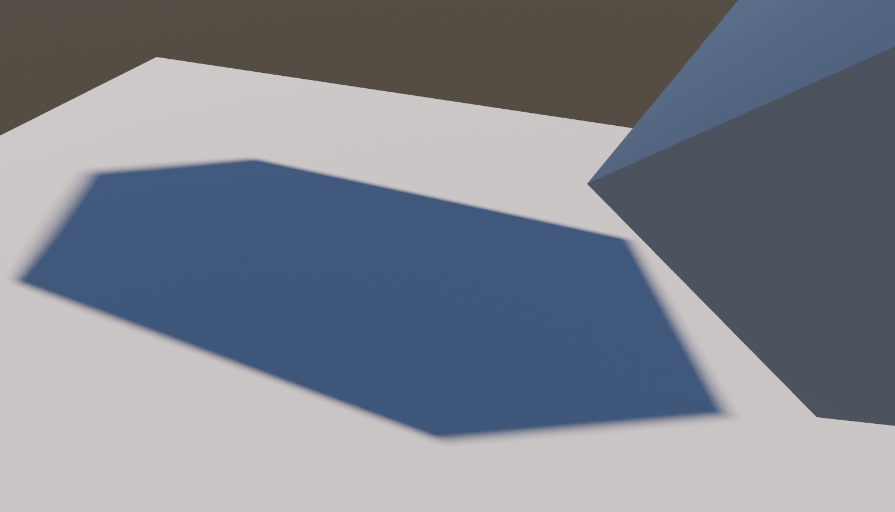

# Optimized CGInclude files

## Introduction:
* Unity's PBR Shaders(include standard surface shaders) will usually call the lightingStandard functions in CGIncludes. However, there are lots of performance defection in Unity's default cginc. Thus, this project deeply optimized the lighting calculation functions in cginc files. Include deferred rendering path PBS functions, forward rendering path(forward base pass and forward add pass) PBS functions and Standard BRDF functions.
* Unity's shadow is designed for low-end devices, which is not suitable for next generation level design, thus, a PCSS soft shadow implementation has been provided. By using PCSS shadow, 

## Manual:
### For native cginclude:
* Open your UnityEditor's CGIncludes folder. For example: "C:/Program Files/Unity/Editor/Data/CGIncludes"
* Backup the origin folder;
* replace it with the new CGIncludes folder.
* Restart your Unity Editor.

### For PCSS Directional Shadow
* Make sure the native .cginc files has already been replaced.
* Add PCSS_Directional.cs as a singleton component in scene.
* Replace the built-in screen space shadow shader to PCSS_Directional.shader (Edit/Project Settings/Graphics).
* Transform the component's variables to fit your own project.
* We decide to use time sample to reduce the un-perfact shadowmap samples and performance limitation, so some dynamic noise points may be made on the edge of shadow, by using TAA as post-processing in your project will be an ideal solution to cover this problem.